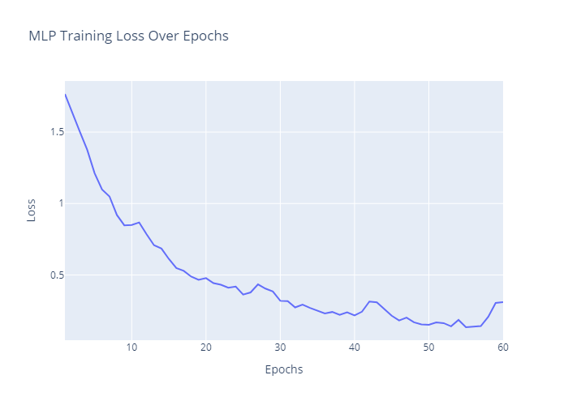
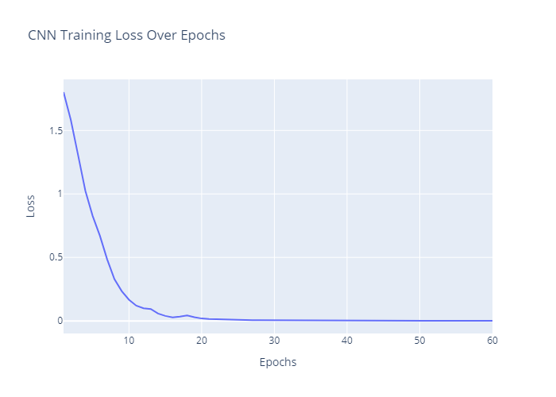
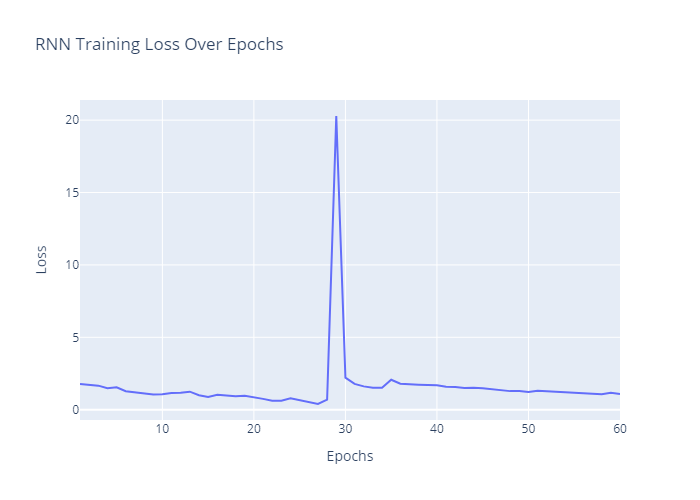
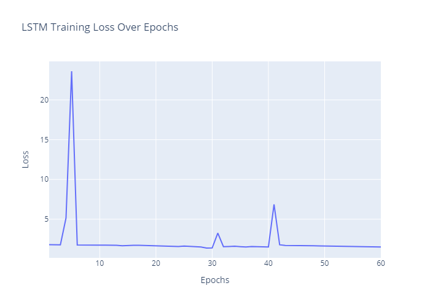
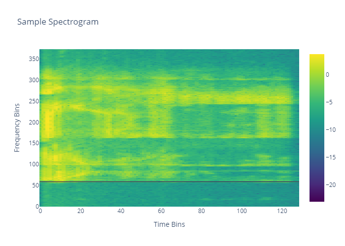

# Human Activity and Audio Recognition Project

## Table of Contents

1. [Introduction](#introduction)
2. [Theoretical Framework](#theoretical-framework)
3. [Problem Description](#problem-description)
4. [Proposed Solution](#proposed-solution)
   - [Human Activity Recognition (HAR)](#human-activity-recognition-har)
   - [Audio Recognition](#audio-recognition)
5. [Results](#results)
6. [Conclusions](#conclusions)
7. [Repository Structure](#repository-structure)
8. [How to Run](#how-to-run)

## Introduction

This project encompasses two core tasks in machine learning:
1. **Human Activity Recognition (HAR)**: The classification of physical activities based on time-series accelerometer data.
2. **Audio Recognition**: The classification of spoken mathematical operations using audio signals.

Both tasks involve preprocessing complex datasets, designing deep learning models, training them to learn patterns in the data, and evaluating their performance using appropriate metrics. This repository serves as a comprehensive guide for anyone aiming to tackle similar problems using state-of-the-art neural networks.

## Theoretical Framework

### Deep Learning in Human Activity Recognition
HAR is a challenging task due to its reliance on temporal signals and sensor noise. Deep learning offers robust solutions:
- **Convolutional Neural Networks (CNNs)** excel at detecting spatial patterns in accelerometer signals.
- **Recurrent Neural Networks (RNNs)**, including **Long Short-Term Memory (LSTM)** units, capture temporal dependencies across sequential data.

### Deep Learning in Audio Recognition
Spectrogram-based audio recognition treats audio signals as 2D images, enabling the use of CNNs for feature extraction. By analyzing frequency and time-domain information, deep learning models can effectively classify commands.

### Architectures Explained
1. **Multilayer Perceptron (MLP)**: Fully connected layers process flattened feature vectors, learning generalized patterns but lacking spatial or temporal awareness.
2. **Convolutional Neural Networks (CNNs)**: Extract local patterns using convolutional layers, ideal for spectrograms and spatial features in time-series data.
3. **Recurrent Neural Networks (RNNs)**: Capture sequential dependencies by processing data step-by-step, with memory of previous inputs.
4. **Long Short-Term Memory (LSTM)**: A special RNN variant designed to overcome vanishing gradients by maintaining long-term dependencies.

## Problem Description

### Human Activity Recognition
The dataset consists of accelerometer signals for six physical activities:
1. Shake side-to-side (**agitar a los lados**)
2. Shake up and down (**agitar arriba abajo**)
3. Jump (**brincar**)
4. Walk (**caminar**)
5. Move in circles (**círculos**)
6. Jog (**trotar**)

The problem is to classify these activities using a deep learning model.

### Audio Recognition
Audio commands for mathematical operations (e.g., "two plus nine", "four minus five", "three times seven", "five divided by eight", "square root of seven", "zero to the power of three") are provided as `.wav` files. The problem is to preprocess these files, extract meaningful features, and classify the spoken command.

## Proposed Solution

### Human Activity Recognition (HAR)

#### Data Preprocessing
1. **Normalization**: All accelerometer signals are normalized to a range of [0, 1].
2. **Windowing**: Sliding windows of fixed size (e.g., 50 samples) are extracted to capture local temporal patterns.
3. **Label Alignment**: Each window is labeled based on the majority activity within the window.

#### Architectures and Training
- **MLP**:
  - Fully connected layers process flattened time-series windows.
  - Acts as a baseline with no spatial/temporal pattern recognition.
- **CNN**:
  - Convolutional layers extract spatial features from accelerometer signals.
  - MaxPooling reduces dimensionality while retaining key patterns.
  - Dense layers classify activities based on extracted features.
- **RNN and LSTM**:
  - Sequential layers capture dependencies across time.
  - LSTM handles long-term dependencies, enabling improved performance on complex sequences.

Training was conducted for 60 epochs using cross-entropy loss and Adam optimizer. A batch size of 32 was used to balance computational efficiency and performance.

### Audio Recognition

#### Data Preprocessing
1. **Spectrogram Conversion**:
   - `.wav` files are transformed into spectrograms using Short-Time Fourier Transform (STFT).
   - The spectrograms capture frequency (y-axis) vs. time (x-axis) information.
2. **Resizing and Normalization**:
   - Spectrograms are resized to a fixed resolution (128x128).
   - Pixel values are normalized to [0, 1].

#### Architecture and Training
- **CNN**:
  - Convolutional layers detect spatial features in spectrograms.
  - Pooling layers reduce resolution, ensuring computational efficiency.
  - Dense layers combine features for classification.
- Training was conducted for 50 epochs with a batch size of 16 using categorical cross-entropy loss.

## Results

### Human Activity Recognition
**Model Performance**:
- **MLP**: 84.72% Accuracy, Loss = 0.3054
- **CNN**: 97.22% Accuracy, Loss = 0.0731
- **RNN**: 40.28% Accuracy, Loss = 1.0988
- **LSTM**: 33.33% Accuracy, Loss = 1.4949

**Confusion Matrices**:





### Audio Recognition
- **CNN Accuracy**: 97.1%, Loss = 0.0673

**Spectrogram Training Loss**:


## Conclusions

1. **Human Activity Recognition**:
   - CNNs performed best due to their ability to detect local patterns in accelerometer signals.
   - RNN and LSTM models underperformed, possibly due to insufficient training or hyperparameter optimization for sequential data.
   - The high accuracy of CNNs (97.22%) suggests they are well-suited for HAR tasks.

2. **Audio Recognition**:
   - Treating audio as images (spectrograms) allowed CNNs to achieve near-perfect accuracy (97.1%).
   - This approach is robust, as it captures both time and frequency-domain information effectively.

3. **Future Work**:
   - Experiment with GRU or transformer-based architectures for HAR to improve temporal pattern recognition.
   - Investigate ensemble methods combining CNNs and RNNs for audio tasks.

## Repository Structure

```
├───data
│ ├───mathematical_operations
│ │ ├───testing
│ │ └───training
│ └───movements
│ ├───testing
│ └───training
├───notebooks
│ ├───pycache
│ └───output_graphs
├───output_audios
└───output_graphs
```

## How to Run

1. **Clone Repository**:
   ```
   git clone https://github.com/lfelipecas/sequential_data_dl_assignment1
   ```
2. **Install Dependencies**:
   ```
   pip install -r requirements.txt
   ```
3. **Run Notebooks**:
   - `notebooks/audio_recognition.ipynb`: Audio recognition pipeline.
   - `notebooks/human_activity_recognition.ipynb`: HAR pipeline.
4. **View Results**:
   - Plots and confusion matrices are saved in the `output_graphs/` directory.